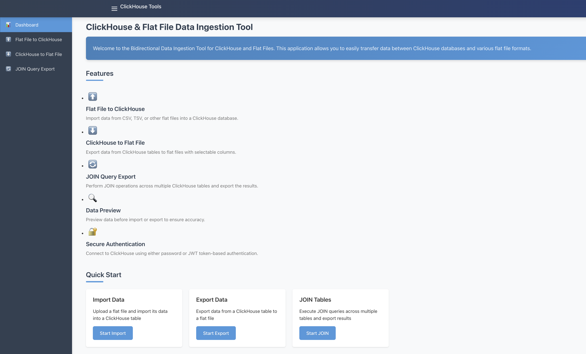

# ClickHouse Flat File Tool

A bidirectional data ingestion tool that seamlessly transfers data between ClickHouse databases and flat files (CSV, TSV, TXT).



## Overview

This application enables data engineers and analysts to:
- **Export data** from ClickHouse tables to various flat file formats
- **Import data** from flat files into new or existing ClickHouse tables
- **Preview data** before finalizing any operation
- **Select specific columns** for targeted data transfers
- **Handle large datasets** efficiently through streaming and chunking

Built with a React frontend and Node.js/Express backend, the tool provides an intuitive interface for data movement operations while handling complexities like schema mapping, data type conversion, and authentication management.

## Features

### Import (Flat File to ClickHouse)
- Upload CSV, TSV, and TXT files with custom delimiters
- Automatic schema detection from file headers
- Create new tables or append to existing ones
- Configure column mappings and data types
- Set table creation options (engine, partition keys, etc.)
- Preview sample data before import
- Monitor import progress with record count tracking

### Export (ClickHouse to Flat File)
- Connect to ClickHouse using password or JWT authentication
- Browse and select available tables and databases
- Choose specific columns for targeted exports
- Preview data before finalizing export
- Configure output format (CSV, TSV, TXT) with custom delimiters
- Download exported files directly from the browser
- View export statistics including record counts

### Common Features
- Secure JWT-based authentication for ClickHouse connections
- Intuitive step-by-step workflow with clear navigation
- Responsive design for desktop and tablet use
- Comprehensive error handling and user feedback
- Progress tracking for long-running operations

## Technical Architecture

### Frontend
- **Framework**: React with TypeScript
- **State Management**: React Hooks
- **Styling**: CSS with CSS Variables for theming
- **HTTP Client**: Axios for API requests
- **Build Tool**: Vite

### Backend
- **Runtime**: Node.js with Express
- **Database Client**: ClickHouse HTTP client
- **File Handling**: Multer for uploads, streaming for downloads
- **Authentication**: JWT token generation and validation
- **API Structure**: RESTful endpoints with controller-service pattern

## Installation

### Prerequisites
- Node.js (v16+)
- npm or yarn
- ClickHouse database (local or remote)

### Setup

1. Clone the repository
   ```bash
   git clone https://github.com/yourusername/ch_flatfile_tool.git
   cd ch_flatfile_tool
   ```

2. Install server dependencies
   ```bash
   cd server
   npm install
   ```

3. Create server environment file
   ```bash
   cp .env.example .env
   # Edit .env with your configuration
   ```

4. Install client dependencies
   ```bash
   cd ../client
   npm install
   ```

5. Start the development servers
   ```bash
   # In server directory
   npm run dev
   
   # In client directory (in a new terminal)
   npm run dev
   ```

6. The application will be available at http://localhost:5173

## Usage Examples

### Exporting from ClickHouse to CSV

1. **Connect to ClickHouse**

   - Enter your ClickHouse connection details
   - Choose between Password or JWT Token authentication
   - Click "Connect" to establish connection

2. **Select Source Table**

   - Browse available databases and tables
   - Click on a table to select it as your data source

3. **Configure Export**

   - Select columns to include in the export
   - Choose output format (CSV, TSV, TXT)
   - Set delimiter options
   - Click "Preview Data" to see sample output

4. **Complete Export**

   - Review export statistics
   - Click "Download File" to save the exported data
   - Start a new export if needed

### Importing from CSV to ClickHouse

1. **Upload File**

   - Drag and drop your file or click to browse
   - Set file format options (delimiter, has header)
   - Click "Upload" to process the file

2. **Configure Import**

   - Enter target table name
   - Map columns between source file and target table
   - Set data types for each column
   - Choose table creation options

3. **Preview and Import**

   - Review sample data with applied mappings
   - Click "Start Import" to begin data transfer

4. **Import Complete**

   - View import statistics
   - Start a new import if needed

## Development

### Project Structure
```
ch_flatfile_tool/
├── client/                 # React frontend application
│   ├── public/             # Static assets
│   ├── src/
│   │   ├── components/     # Reusable UI components
│   │   ├── pages/          # Page components
│   │   ├── services/       # API client and services
│   │   ├── utils/          # Helper functions
│   │   └── App.tsx         # Main application component
├── server/                 # Node.js/Express backend
│   ├── src/
│   │   ├── controllers/    # Request handlers
│   │   ├── routes/         # API route definitions
│   │   ├── services/       # Business logic
│   │   └── utils/          # Helper functions
│   └── uploads/            # Temporary file storage
└── docker-compose.yml      # Docker configuration
```

### Testing

Run backend tests:
```bash
cd server
npm test
```

Run frontend tests:
```bash
cd client
npm test
```

### Production Deployment

Build the client:
```bash
cd client
npm run build
```

Start the production server:
```bash
cd server
npm start
```

Alternatively, use Docker:
```bash
docker-compose up -d
```

## Troubleshooting

### Common Issues

#### Connection to ClickHouse fails
- Verify that ClickHouse is running (`brew services list`)
- Check if the port is correct (8123 for HTTP, 9000 for native)
- Ensure user credentials are correct
- Try connecting with the ClickHouse client: `clickhouse-client --host=localhost --port=8123`

#### File upload errors
- Check that the file size is under the limit (10MB by default)
- Verify the file format matches the selected format in the UI
- Ensure the file has headers if that option is selected

#### JWT authentication issues
- Verify that the JWT secret in .env matches the one in ClickHouse config
- Check token expiration time
- Ensure the token contains the necessary claims for ClickHouse

### Logs

Server logs are available at:
- Docker: `docker-compose logs -f server`
- Manual: Check the terminal where you started the server

Client-side errors are logged to the browser console.

## Environment Variables

Create a `.env` file in the server directory with the following variables:

```properties
# Server configuration
PORT=3001
NODE_ENV=development

# ClickHouse connection
CLICKHOUSE_HOST=localhost
CLICKHOUSE_PORT=8123
CLICKHOUSE_USER=default
CLICKHOUSE_DB=default
CLICKHOUSE_PASSWORD=

# JWT configuration
JWT_SECRET=your_jwt_secret_here
JWT_EXPIRES_IN=1h

# File uploads
UPLOAD_TEMP_DIR=./uploads
MAX_FILE_SIZE=10485760  # 10MB in bytes
```

